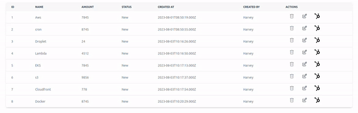

# VueTable

This is a Table component for Vue.js



## Installation

```
npm i @harv46/vue-table
```

## Basic usage example

```js
<script setup>
import { VueTable  } from "@harv46/vue-table"
import "@harv46/vue-table/dist/style.css"

const header = ["Name", "Age"]
const keys=["name", "age"]

const data = [{
    name: "Example Name 1",
    age: 22
}, {
    name: "Example Name 2",
    age: 17
}]
</script>

<template>
    <div>
      <VueTable :headers="header" :data="data" :keys="keys" />
    </div>
</template>
```

### Dark mode

```js
<template>
    <div>
      <VueTable :headers="header" :data="data" :keys="keys" dark />
    </div>
</template>
```

## Advance usage example

```js
<script setup>
    import { VueTable  } from "@harv46/vue-table"
    import "@harv46/vue-table/dist/style.css"
    const headers = ["id", "name", "amount", "status", "Created By"];
    const keyValue = [
        "id",
        "name",
        "amount",
        "status",
        ["createdUser", "user", "name"],
    ];

    {/* getData[0].createdUser.user.name || [ ["createdUser", "user", "name"] ] */}

    {/* get data from api || store */}
    const getData = () => {}
</script>

<template>
    <VueTable :headers="headers" :keys="keyValue" :data="getData">
        <template #th>
            <th> Actions</th>
        </template>
        <template #td="{ item }">
            {/* item will be the object in a row */}
            <td class="flex">
                <DeleteIcon @click="deleteItem(item.id)" />
                <EditIcon @click="edit(item)" />
            </td>
        </template>
    </VueTable>
<template>
```

### Props

| Prop      | Description                            | Default |
| --------- | -------------------------------------- | ------- |
| `data`    | Data to be rendered                    | `[]`    |
| `headers` | heading of the table                   | `[]`    |
| `keys`    | Keys of the table data (can be nested) | `[]`    |
| `dark`    | Dark mode                              | `false` |
