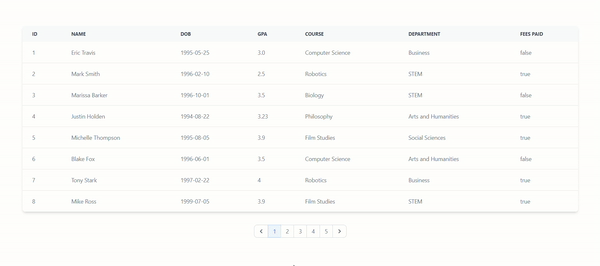

# VueTable + VuePaginator

This is a Table component for Vue.js


## Installation

```
npm i @harv46/vue-table
```

## Basic usage example

```js
<script setup>
import { VueTable  } from "@harv46/vue-table"
import "@harv46/vue-table/dist/style.css"

const header = ["Name", "Age"]
const keys=["name", "age"]

const data = [{
    name: "Example Name 1",
    age: 22
}, {
    name: "Example Name 2",
    age: 17
}]
</script>

<template>
    <div>
      <VueTable :headers="header" :data="data" :keys="keys" />
    </div>
</template>
```

### Dark mode

```js
<template>
    <div>
      <VueTable :headers="header" :data="data" :keys="keys" dark />
    </div>
</template>
```

## Advance usage example

```js
<script setup>
    import { VueTable  } from "@harv46/vue-table"
    import "@harv46/vue-table/dist/style.css"
    const headers = ["id", "name", "amount", "status", "Created By"];
    const keyValue = [
        "id",
        "name",
        "amount",
        "status",
        ["createdUser", "user", "name"],
    ];

    {/* getData[0].createdUser.user.name || [ ["createdUser", "user", "name"] ] */}

    {/* get data from api || store */}
    const getData = () => {}
</script>

<template>
    <VueTable :headers="headers" :keys="keyValue" :data="getData">
        <template #th>
            <th> Actions</th>
        </template>
        <template #td="{ item }">
            {/* item will be the object in a row */}
            <td class="flex">
                <DeleteIcon @click="deleteItem(item.id)" />
                <EditIcon @click="edit(item)" />
            </td>
        </template>
    </VueTable>
<template>
```

### Props - VueTable

| Prop      | Description                            | Default |
| --------- | -------------------------------------- | ------- |
| `data`    | Data to be rendered                    | `[]`    |
| `headers` | Heading of the table                   | `[]`    |
| `keys`    | Keys of the table data (can be nested) | `[]`    |
| `dark`    | Dark mode                              | `false` |

## VuePaginator



```js

<script setup>
import { VueTable, VuePaginator } from '@harv46/vue-table';
import '@harv46/vue-table/dist/style.css';
import data from '@/assets/data.json';
import { computed, ref, watch } from 'vue';

const headers = [
  'id',
  'name',
  'DOB',
  'GPA',
  'course',
  'department',
  'fees paid'
];
const keyValues = [
  'id',
  'name',
  'date_of_birth',
  'GPA',
  'course',
  'department',
  'fees_paid'
];

const itemsPerPage = 8;

const startOffSet = ref(0);
const endOffSet = ref(startOffSet.value + itemsPerPage);

watch(startOffSet, nOff => {
  endOffSet.value = startOffSet.value + itemsPerPage;
});

const pageCount = Math.ceil(data.length / itemsPerPage);

const currentData = computed(() =>
  data.slice(startOffSet.value, endOffSet.value)
);

function onPageChange(pageNumber) {
  const newOffSet = (pageNumber - 1) * itemsPerPage;
  startOffSet.value = newOffSet;
}
</script>

<template>
  <div
    style="
      width: 90%;
      position: absolute;
      left: 0;
      right: 0;
      margin: 0 auto;
      margin-top: 6%;
    ">
    <VueTable :headers="headers" :keys="keyValues" :data="currentData" />
    <div
      style="
        display: flex;
        flex-direction: column;
        align-items: center;
        margin-top: 2rem;
      ">
      <VuePaginator :pageCount="pageCount" @onPageChange="onPageChange" />
    </div>
  </div>
</template>

```

### Props - VuePaginator

| Prop          | Description                                                                                 | Default |
| ------------- | ------------------------------------------------------------------------------------------- | ------- |
| `large`       | Change the size of the paginator                                                            | `false` |
| `dark`        | Dark mode                                                                                   | `false` |
| `defaultPage` | Default selected page                                                                       | `1`     |
| `bufferCount` | Specify the number of adjacent pages displayed on both sides of the currently selected page | `2`     |
| `pageCount`   | Number of pages to be displayed                                                             | `5`     |
